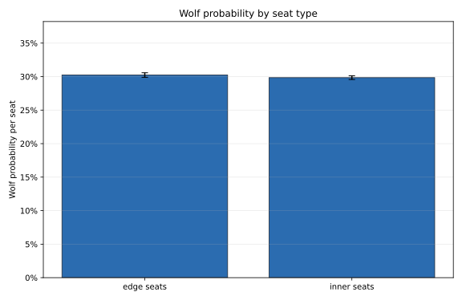
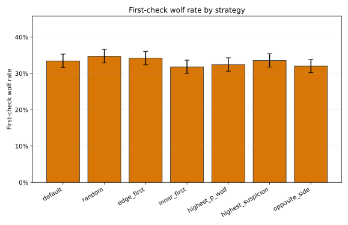
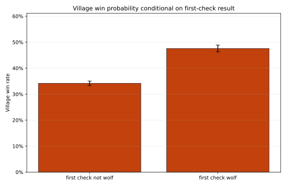
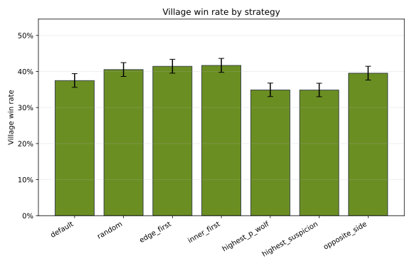
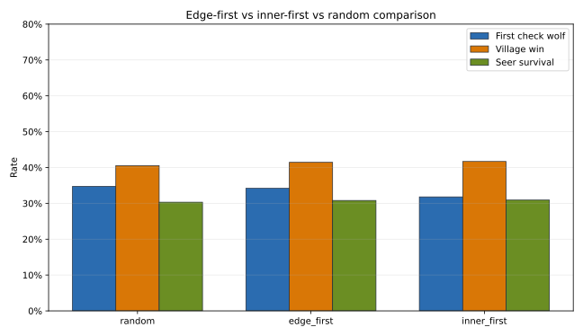
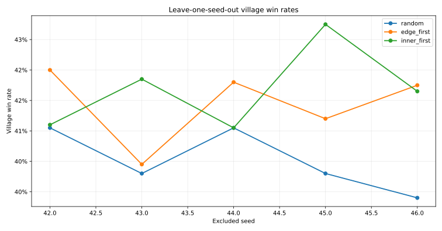

# Game-Level Analysis of Randomized-Role Seer Position Experiment

## Technical Summary

The analysis used `results/ten_player_seer_position_randomized_roles_game_level_raw.csv` as the primary source of truth, with 17,500 completed games covering 7 seer checking strategies, 5 seeds, and 500 games per strategy-seed cell. No simulation code was changed and the raw game-level dataset was preserved unchanged.

**Edge seats were not wolf-heavy after randomization.** Edge seats contained wolves in 30.23% of edge-seat opportunities, compared with 29.85% for inner seats and an expected 30.00% under the 3-wolf / 10-seat role pool. The wolves-on-edge distribution matched the exact hypergeometric expectation closely (chi-square p = 0.281, Cramer's V = 0.009).

**Edge-first did not produce a statistically supported first-check discovery advantage.** Its first-check wolf rate was 34.20%, versus 34.72% for random and 31.80% for inner-first. Random was 0.52 percentage points higher than edge-first in direct comparison (Holm p = 1.000).

**Finding a wolf on the first check was strongly associated with village winning, but it should not be interpreted as a randomized causal effect.** Village win rate was 47.59% when the first check found a wolf and 34.17% otherwise, a 13.41 percentage-point difference. The adjusted village-win model also estimated a positive association (OR = 1.76, 95% CI 1.65-1.88, p = <0.001).

**After adjustment, edge-first did not retain an independent advantage over random or inner-first, although it remained above default.** In the main model with strategy, first-check success, wolves-on-edge, seer seat, seer side, and seed controls, edge-first vs random had OR = 1.05 (95% CI 0.94-1.17, p = 0.417). This weakens the edge-seat theory: structured search paths matter, but edge seats are not uniquely informative once roles are randomized.

## Scope, Data, and Metric Definitions

- **Unit of analysis:** one completed game.
- **Input dataset:** `results/ten_player_seer_position_randomized_roles_game_level_raw.csv`.
- **Strategies:** default, random, edge_first, inner_first, highest_p_wolf, highest_suspicion, and opposite_side.
- **Outcome:** `village_win`, a binary indicator equal to 1 when `winner == village`.
- **First-check success:** `first_check_target_is_wolf == 1`.
- **Seat model:** 4 edge seats and 6 inner seats; each game has 3 wolves assigned randomly across 10 seats.
- **Inference frame:** simulation games are treated as repeated Monte Carlo observations. Seed fixed effects and leave-one-seed-out checks are used for robustness.

## Edge Seats Are Not Intrinsically Wolf-Heavy

The observed edge-seat wolf probability was 30.23% (95% CI 29.89%-30.57%); the inner-seat probability was 29.85% (95% CI 29.57%-30.12%). The expected probability for both seat types is 30.00% because the randomized role pool assigns 3 wolves across 10 seats. The expected number of wolves on edge seats is 1.20; the observed mean was 1.209 (95% CI 1.198-1.220).

The hypergeometric goodness-of-fit test checks the full `wolves_on_edge` distribution, not just the mean. It produced chi-square = 3.824, p = 0.281, and Cramer's V = 0.009. This is statistically and practically consistent with randomized roles rather than an edge-heavy role assignment pattern.

## First-Check Discovery Varies, but Edge-First Is Not Unique

The first-check comparison suggests that structured strategies can shift search paths, but edge-first is not clearly superior. The edge-first first-check wolf rate was 34.20%; inner-first was 31.80%; random was 34.72%; default was 33.44%.

- `random vs edge_first`: difference = 0.52 pp, 95% CI -2.11 to 3.15 pp, Holm p = 1.000, Cohen h = 0.011.
- `edge_first vs inner_first`: difference = 2.40 pp, 95% CI -0.21 to 5.01 pp, Holm p = 1.000, Cohen h = 0.051.
- `default vs edge_first`: difference = -0.76 pp, 95% CI -3.38 to 1.86 pp, Holm p = 1.000, Cohen h = -0.016.

## First-Check Success Predicts Village Wins, with Causal Caveats

Raw village win rate was 47.59% when the first check found a wolf and 34.17% otherwise. The raw odds ratio was 1.75 (95% CI 1.64-1.86, p = <0.001). This is a strong predictive association, but first-check success is not randomized independently of strategy and game state.

## Adjusted Village-Win Model Weakens Edge-Seat Theory

The main logistic model used `random` as the reference strategy and adjusted for first-check success, wolves on edge seats, seer seat, seer side, and seed. Explicit contrasts show:

- `edge_first vs random`: OR = 1.05, 95% CI 0.94-1.17, p = 0.417.
- `edge_first vs inner_first`: OR = 0.98, 95% CI 0.87-1.09, p = 0.665.
- `edge_first vs default`: OR = 1.18, 95% CI 1.06-1.33, p = 0.004.

The adjusted estimates do not support an independent edge-first advantage over random or inner-first. Edge-first is higher than default in the adjusted model, which supports the broader idea that a structured search path can help relative to the default process. It does not establish that edge seats themselves are informative. Highest-p-wolf and highest-suspicion strategies are associated with lower village win rates in this configuration, but those strategies are partly post-belief strategies and should be interpreted as policy comparisons rather than clean causal effects.

## Search-Path Evidence: Structured Paths Matter More Than Edge Seats

Edge-first and inner-first perform similarly on village win rate and first-check success. That pattern is more consistent with structured search changing the seer's path away from the default process than with edge seats being intrinsically informative. Because role assignment is randomized, edge seat status itself does not carry wolf information.

- `random`: first-check wolf 34.72%, village win 40.52% (seed SD 2.04 pp), seer survival 30.32%, mean checks 2.64.
- `edge_first`: first-check wolf 34.20%, village win 41.44% (seed SD 2.51 pp), seer survival 30.80%, mean checks 2.61.
- `inner_first`: first-check wolf 31.80%, village win 41.68% (seed SD 2.76 pp), seer survival 30.92%, mean checks 2.61.

## Interactions and Robustness

Interaction tests were added one at a time to the main model and Holm-corrected across the three requested interaction families. The results were:

- `edge_first_x_wolves_on_edge`: LR = 43.757, df = 1, Holm p = <0.001, delta AIC = -41.76; focal OR per additional edge wolf = 1.50; statistically supported interaction.
- `strategy_x_first_check_target_is_wolf`: LR = 12.303, df = 6, Holm p = 0.111, delta AIC = -0.30; weak or unsupported interaction.
- `seer_seat_type_x_strategy`: LR = 3.856, df = 7, Holm p = 0.796, delta AIC = 10.14; weak or unsupported interaction.

The significant `edge_first_x_wolves_on_edge` interaction means edge-first becomes more favorable when more wolves happen to be on edge seats in a given randomized game. That is conditional heterogeneity, not evidence that edge seats are intrinsically wolf-heavy. Because the role assignment itself is balanced, this does not rescue the edge-seat prior as a general theory.

Leave-one-seed-out checks did not reveal a single seed that reverses the main interpretation. No seed exceeded an absolute z-score of 2 on overall village win rate. Clustered standard errors by seed were also generated as a sensitivity check, but with only five clusters they should be treated as diagnostic rather than definitive.

## Direct Answers to the Research Questions

1. **Are edge seats actually more wolf-heavy after randomization?** No. Observed edge and inner wolf probabilities are both near the 30% expectation.
2. **Does edge_first increase first-check wolf discovery?** Not in a statistically supported or practically meaningful way versus random, inner-first, or default after Holm correction.
3. **Does first-check wolf discovery predict village victory?** Yes. It has a strong positive predictive association with village wins, both raw and adjusted.
4. **Does edge_first retain an independent effect after adjustment?** Not against random or inner-first; it is higher than default, which points to a structured-search effect rather than an edge-seat effect.
5. **Does edge_first outperform inner_first?** No. Their village win rates and first-check wolf rates are very close.
6. **Is edge-seat theory supported, weakened, or rejected?** Weakened to rejected for this randomized-role design: edge seats are not intrinsically more informative once roles are randomized.
7. **What should the next experiment test?** Test whether structured search paths improve information flow under alternate communication rules, not whether edge seats have inherent role risk.

## Limitations and Next Steps

- These are simulation outcomes, not real human game observations.
- First-check success, total seer checks, and seer survival are partly downstream of strategy and game dynamics; post-treatment models are predictive diagnostics, not causal estimates.
- Seed-aware inference is limited by having only five seeds. Leave-one-seed-out analysis is more transparent than relying on clustered standard errors alone.
- The next experiment should isolate structured-search effects from position labels by adding strategy variants that force deterministic but non-positional search paths.
